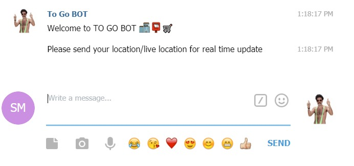

# {To GO BOT}
<http://t.me/place_near_you_bot>

{ONE LINE BOT DESCRIPTION HERE} 

* {John James Benitez}
* {Sarit Merkel}
* {KOBE BRYANT}

{OPTIONAL: MORE PROJECT INFO HERE}

## Screenshots

## How to Run This Bot
COMMAND:
    /start - START THE BOT AND IMMEDIATELY ASK FOR YOUR LOCATION
    /places - SHOWS PLACES YOU CHOSE (TO GO LIST) 
### Prerequisites
* Python 3.7 or 3.8
* pipenv
* pymongo
* requests
* logging

### Setup
* Clone this repo from github
* Install dependencies: `pipenv install`
* Get a BOT ID from the [botfather](https://telegram.me/BotFather).
* Create a `secrets.py` file:

        BOT_TOKEN = "your-bot-token-here"

### Run
To run the bot use:

    pipenv run python bot.py

### Running tests
First make sure to install all dev dependencies:

    pipenv install --dev

To run all test  use:

    pipenv run pytest

(Or just `pytest` if running in a pipenv shell.)

## Credits and References
* [Telegram Docs](https://core.telegram.org/bots)
* [python-telegram-bot](https://github.com/python-telegram-bot/python-telegram-bot)
* {ADD MORE REFERENCES TO LIBRARIES, APIS AND CODE SNIPPETS HERE}
